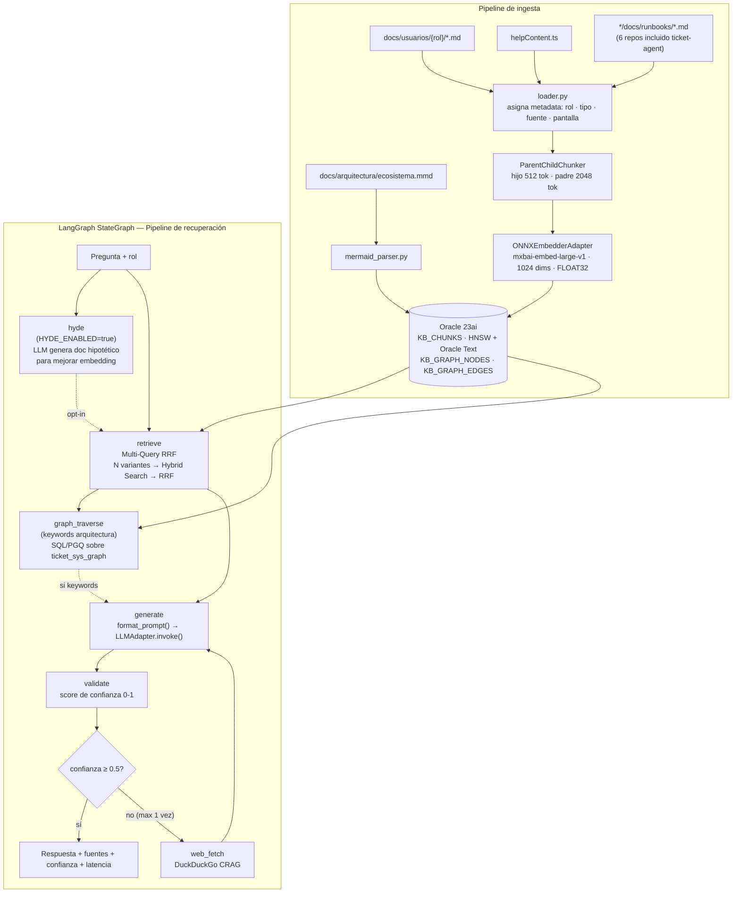

# 02 — Arquitectura Técnica

Descripción del diseño interno de ticket-agent, decisiones de arquitectura y estado actual.

---

## Diagrama — Estado actual (Fase 4)



---

## Ruta de evolución

```
FASE 1 ✅
  Vector store : FAISS-cpu local
  Embeddings   : mxbai-embed-large-v1, 1024 dims  ← FIJO
  Chunking     : flat (RecursiveCharacterTextSplitter)
  LLM          : Ollama local / OCI GenAI
  Interfaz     : CLI

FASE 2 ✅ (completada 2026-05-23)
  Vector store : Oracle 23ai Free (Autonomous AI Database, OCI)
  Chunking     : Parent-Child (hijo 512 / padre 2048) — re-ingesta realizada
  Hybrid Search: Vector HNSW + Oracle Text BM25 con RRF (α=0.7)
  Factory      : VectorStoreFactory — FAISS | Oracle según VECTOR_STORE en .env

FASE 3 ✅ (completada 2026-05-27)
  Orquestación : LangGraph StateGraph
  Retrieval    : Multi-Query RRF + HyDE (opt-in con HYDE_ENABLED=true)
  Property Graph: Mermaid → Oracle 23ai SQL/PGQ → nodo graph_traverse
  CRAG         : web_fetch real — DuckDuckGo + Context Assembly (CRAG_ENABLED=true)

FASE 4 ✅ (completada 2026-05-24)
  API          : FastAPI REST (puerto 8002)
  Container    : Dockerfile + podman-compose + ticket-management-network
  Observ.      : LangSmith (proyecto ticket-agent-dev) + Prometheus /metrics
  Pendiente    : Docling (PDF/DOCX), Diagnostic Agent, Remediation Agent
```

---

## Decisión crítica: modelo de embeddings

| Parámetro | Valor |
|---|---|
| Modelo | `mixedbread-ai/mxbai-embed-large-v1` |
| Dimensiones | **1024** |
| Tipo | FLOAT32 |
| Razón | Compatible con Oracle 23ai HNSW desde Día 1 — migración FAISS → Oracle sin re-ingesta |

**Esta decisión es permanente** para la vida del índice actual. Cambiar el modelo requiere re-ingestar todos los documentos.

---

## Patrón de adapters

Toda dependencia externa (LLM, embeddings, vector store) se accede a través de interfaces abstractas.
Cambiar de proveedor solo requiere modificar `.env`.

```
LLMAdapter (ABC)
  ├── OllamaLLMAdapter    → ChatOllama (langchain-ollama)
  └── OCILLMAdapter       → ChatOCIGenAI (langchain-oci)

EmbedderAdapter (ABC)
  └── ONNXEmbedderAdapter → SentenceTransformer (sentence-transformers)

VectorStoreFactory
  ├── FAISSVectorStore    → faiss-cpu + filtrado por rol en Python
  └── OracleVSAdapter     → oracledb + filtro JSON_EXISTS + HNSW + Oracle Text
```

---

## Fuentes de conocimiento y metadata

El vector store Oracle contiene chunks de tres fuentes en una sola tabla (`KB_CHUNKS`).
El filtrado por rol se hace pre-retrieval en SQL — sin over-fetch en Python.

Metadata por chunk:

| Campo | Valores posibles | Uso |
|---|---|---|
| `rol` | `["usuario"]`, `["manager", "admin"]`, `["soporte"]`, etc. | Filtrado pre-SQL con `JSON_EXISTS` |
| `tipo` | `usuarios`, `runbooks`, `helpContent` | Tipo de fuente |
| `fuente` | path del archivo | Trazabilidad de la respuesta |
| `pantalla` | `newTicket`, `draftReview`, etc. | Solo para helpContent |
| `is_parent` | `0` (hijo) / `1` (padre) | Estrategia parent-child |

Mapeo pantalla → rol en `help_serializer.py`:

| Pantalla | Roles |
|---|---|
| newTicket, ticketDetail, attachments, ticketEvents | usuario, manager, admin |
| draftReview | manager, admin |
| classificationManagement, userManagement, permissionManagement | admin |

---

## Chunking — Parent-Child

```
ParentChildChunker
  Hijo  : 512 tokens  (para embedding y retrieval)
  Padre : 2048 tokens (para contexto completo al LLM)
  Overlap hijo: 100 tokens

Resultado actual: 1251 hijos + 306 padres = 1557 chunks en KB_CHUNKS
```

El retrieval busca por embedding de hijo, pero el contexto que llega al LLM es el padre completo.
Con `RETRIEVAL_K=6` se cubre documentos que generan 2 chunks padre.

---

## Hybrid Search

```
retrieve_hybrid(query, k, rol, alpha):
  1. Vector search HNSW — top 20 chunks (over-fetch × 4)
  2. Oracle Text BM25 — CONTAINS(CONTENT, :bm25_query, 1) — top 20 chunks
  3. RRF fusion — score = α/(60+vec_rank+1) + (1-α)/(60+bm25_rank+1)
  4. Top-K por RRF score → LEFT JOIN padre → contexto completo

Variables: HYBRID_ALPHA=0.7, RETRIEVAL_K=6
Fallback: si Oracle Text no disponible → solo vector search
```

---

## Property Graph

```
Fuente: docs/arquitectura/ecosistema.mmd
Parser: mermaid_parser.py → GraphNode + GraphEdge (dataclasses)
Storage: KB_GRAPH_NODES + KB_GRAPH_EDGES + ticket_sys_graph (PROPERTY GRAPH)

Activación en LangGraph: keywords de arquitectura en la query
  {"depende", "usa", "cae", "impacto", "servicios", "arquitectura", ...}

SQL/PGQ:
  SELECT * FROM GRAPH_TABLE(ticket_sys_graph
      MATCH (a IS service)-[e IS depends]->(b IS service)
      WHERE a.LABEL = :lbl
      COLUMNS (...))
```

---

## Estructura de carpetas clave

```
src/
├── main.py                        # CLI — entry point
├── config.py                      # Pydantic BaseSettings + .env
├── adapters/                      # Providers intercambiables (LLM + embeddings)
├── document_processing/
│   ├── loader.py                  # Carga multi-fuente
│   ├── chunking.py                # DocumentChunker + ParentChildChunker
│   ├── mermaid_parser.py          # .mmd → GraphNode + GraphEdge
│   ├── help_serializer.py         # helpContent.ts → chunks
│   └── schema.py                  # Document, Chunk, GraphNode, GraphEdge
├── vector_store/
│   ├── factory.py                 # VectorStoreFactory
│   ├── faiss_store.py             # FAISS adapter
│   └── oracle_store.py            # Oracle 23ai adapter (retrieve, hybrid, graph)
├── rag/
│   ├── retriever.py               # Retriever wrapper
│   └── prompts.py                 # SYSTEM_PROMPT, RAG_PROMPT, MULTI_QUERY_PROMPT, HYDE_PROMPT
├── agent/
│   ├── state.py                   # AgentState TypedDict
│   ├── nodes.py                   # hyde, retrieve, multi_query, generate, validate, web_fetch, graph_traverse
│   └── graph.py                   # build_graph() → CompiledGraph
├── api/                           # REST API FastAPI (Fase 4)
│   ├── main.py                    # FastAPI app + lifespan
│   ├── models/                    # QueryRequest, QueryResponse, HealthResponse...
│   └── routes/                    # /api/v1/health, /api/v1/info, /api/v1/query
└── utils/                         # Logger, validators

db/
└── migrations/oracle/
    ├── V1__init_kb.sql            # KB_CHUNKS, KB_INGEST_LOG, HNSW, Oracle Text (aplicado 2026-05-23)
    └── V2__add_graph_tables.sql   # KB_GRAPH_NODES, KB_GRAPH_EDGES, ticket_sys_graph (aplicado 2026-05-27)

docs/arquitectura/
└── ecosistema.mmd                 # Fuente del Property Graph — 25 nodos, 30 aristas
```

---

## Dependencias principales

| Paquete | Versión | Rol |
|---|---|---|
| `langchain` | >=0.3,<2.0 | Orquestación base |
| `langchain-community` | >=0.3,<2.0 | Integración Oracle Text |
| `langchain-ollama` | latest | Adapter Ollama |
| `langchain-oci` | 0.2.5 | Adapter OCI GenAI |
| `langgraph` | >=0.2,<2.0 | StateGraph |
| `oracledb` | >=2.0,<3.0 | Driver Oracle 23ai + Wallet |
| `faiss-cpu` | 1.8.x | Vector store local (FAISS mode) |
| `sentence-transformers` | >=2.7 | Modelo ONNX embeddings |
| `fastapi` | >=0.110 | REST API |
| `pydantic-settings` | 2.x | Config desde .env |
| `click` | >=8.1 | CLI |

---

## Variables de entorno — referencia completa

### LLM

| Variable | Default | Descripción |
|---|---|---|
| `PROVIDER` | `ollama` | Provider LLM activo: `ollama` \| `oci` |
| `OLLAMA_BASE_URL` | `http://localhost:11434` | URL de Ollama. En contenedor: `http://host.containers.internal:11434` |
| `OLLAMA_LLM_MODEL` | `llama3.2:3b` | Modelo Ollama a usar |
| `OCI_CONFIG_FILE` | `~/.oci/config` | Ruta al config de OCI (dentro del contenedor: `/root/.oci/config`) |
| `OCI_PROFILE` | `DEFAULT` | Perfil del config OCI |
| `OCI_COMPARTMENT_ID` | — | OCID del compartment |
| `OCI_SERVICE_ENDPOINT` | `https://inference.generativeai.us-chicago-1.oci.oraclecloud.com` | Endpoint OCI GenAI |
| `OCI_MODEL` | `cohere.command-r-plus-08-2024` | Modelo OCI GenAI |
| `OCI_TEMPERATURE` | `0` | Temperatura de generación |
| `OCI_MAX_TOKENS` | `1400` | Máximo de tokens en la respuesta |

### Embeddings

| Variable | Default | Descripción |
|---|---|---|
| `EMBED_MODEL_TYPE` | `onnx` | Tipo de embedder (solo `onnx` soportado actualmente) |
| `EMBED_MODEL_NAME` | `mxbai-embed-large-v1` | Modelo ONNX — **no cambiar sin re-ingestar** |
| `EMBED_DIMS` | `1024` | Dimensiones del vector — debe coincidir con Oracle `VECTOR(1024, FLOAT32)` |

### Vector Store

| Variable | Default | Descripción |
|---|---|---|
| `VECTOR_STORE` | `faiss` | Store activo: `faiss` \| `oracle` |
| `VECTOR_DB_PATH` | `./data/vector_db/faiss_index/` | Ruta del índice FAISS (solo modo faiss) |
| `VECTOR_DB_CHUNKS_PATH` | `./data/processed/chunks.jsonl` | Chunks exportados — usado por `/api/v1/info` |
| `ORACLE_USER` | `AGENTE` | Usuario Oracle 23ai |
| `ORACLE_PASSWORD` | — | Contraseña Oracle |
| `ORACLE_DSN` | `ticketagent_tp` | DSN del Wallet |
| `ORACLE_CONFIG_DIR` | `/root/.oci/wallet_ticketagent` | Ruta wallet dentro del contenedor |
| `ORACLE_WALLET_DIR` | `/root/.oci/wallet_ticketagent` | Ruta wallet (igual que CONFIG_DIR) |
| `ORACLE_WALLET_PASSWORD` | — | Contraseña del wallet |
| `ORACLE_TABLE` | `KB_CHUNKS` | Tabla principal de chunks vectoriales |

### Fuentes de conocimiento

| Variable | Default | Descripción |
|---|---|---|
| `SOURCE_USUARIOS` | `../ticket-management/docs/usuarios` | Documentación por rol de usuarios |
| `SOURCE_RUNBOOKS` | *(6 repos)* | Rutas CSV de runbooks del ecosistema |
| `SOURCE_HELP_TS` | `../ticket-management/frontend/src/components/help/helpContent.ts` | Help contextual del frontend |
| `SOURCE_MANUALES` | — | Manuales técnicos vía Docling (PDF/DOCX). Vacío = desactivado |
| `SOURCE_INCIDENTES` | — | Incidentes históricos vía Docling. Vacío = desactivado |

### RAG y retrieval

| Variable | Default | Descripción |
|---|---|---|
| `CHUNK_SIZE` | `512` | Tamaño del chunk hijo en tokens |
| `CHUNK_OVERLAP` | `100` | Overlap entre chunks hijos |
| `CHUNKING_STRATEGY` | `flat` | `flat` \| `parent_child` (parent_child requiere `VECTOR_STORE=oracle`) |
| `PARENT_CHUNK_SIZE` | `2048` | Tamaño del chunk padre en tokens |
| `RETRIEVAL_K` | `3` | Chunks finales que pasan al nodo `generate` |
| `MULTI_QUERY_N` | `3` | Variantes de query generadas para Multi-Query RRF |
| `HYDE_ENABLED` | `false` | Activa nodo `hyde` (doc hipotético pre-embedding) |
| `GRAPH_MMD_PATH` | `./docs/arquitectura/ecosistema.mmd` | Fuente del Property Graph |
| `HYBRID_SEARCH` | `false` | Activa Hybrid Search (HNSW + BM25 + RRF) |
| `HYBRID_ALPHA` | `0.7` | Peso del vector search en RRF (1-alpha = peso BM25) |
| `CRAG_ENABLED` | `false` | Activa búsqueda web DuckDuckGo cuando confianza < 0.5 |
| `CRAG_MAX_RESULTS` | `3` | Máximo de resultados web a fusionar al contexto |

### API y observabilidad

| Variable | Default | Descripción |
|---|---|---|
| `CORS_ORIGINS` | `http://localhost:3001` | Orígenes CORS permitidos (CSV). Incluir URL de support-console |
| `LOG_LEVEL` | `INFO` | Nivel de logging: `DEBUG` \| `INFO` \| `WARNING` \| `ERROR` |
| `LANGCHAIN_TRACING_V2` | `false` | Activa trazas LangSmith |
| `LANGCHAIN_API_KEY` | — | API key de LangSmith |
| `LANGCHAIN_PROJECT` | `ticket-agent-dev` | Proyecto LangSmith donde se registran las trazas |

---

## Esquema Oracle 23ai

### Migraciones aplicadas

| Migración | Fecha | Contenido |
|---|---|---|
| `V1__init_kb.sql` | 2026-05-23 | `KB_CHUNKS`, índices HNSW + Oracle Text, `KB_INGEST_LOG`, vista `V_KB_LEAF_CHUNKS` |
| `V2__add_graph_tables.sql` | 2026-05-27 | `KB_GRAPH_NODES`, `KB_GRAPH_EDGES`, Property Graph `ticket_sys_graph` |
| `V3__add_specialized_tables.sql` | pendiente | `KB_MANUALS`, `KB_RUNBOOKS`, `KB_INCIDENTS`, `KB_ERROR_CATALOG` |

### KB_CHUNKS — tabla principal (V1)

```sql
KB_CHUNKS
├── CHUNK_ID    VARCHAR2(36)         PK
├── PARENT_ID   VARCHAR2(36)         FK → KB_CHUNKS(CHUNK_ID) — null en chunks padre
├── CONTENT     CLOB                 Texto del chunk
├── EMBEDDING   VECTOR(1024,FLOAT32) Vector semántico
├── SOURCE_FILE VARCHAR2(512)        Ruta del archivo fuente
├── TIPO        VARCHAR2(50)         'usuarios' | 'runbooks' | 'helpContent' | 'manuales' | 'incidentes'
├── FUENTE      VARCHAR2(100)        Nombre descriptivo de la fuente
├── PANTALLA    VARCHAR2(100)        Solo helpContent: newTicket | draftReview | etc.
├── ROL_JSON    JSON                 ["usuario"] | ["manager","admin"] | etc.
├── IS_PARENT   NUMBER(1,0)          0=hijo (retrieval) | 1=padre (contexto LLM)
└── CREATED_AT  TIMESTAMP

Índices:
  idx_kb_embedding    → VECTOR INDEX HNSW, DISTANCE COSINE, TARGET ACCURACY 95
  idx_kb_content_text → Oracle Text CTXSYS.CONTEXT (BM25 / Hybrid Search)
  idx_kb_tipo         → filtros por tipo
  idx_kb_is_parent    → separación hijo/padre

Vista: V_KB_LEAF_CHUNKS → solo IS_PARENT=0 (usada por OracleVSAdapter)
```

### KB_GRAPH_NODES / KB_GRAPH_EDGES — Property Graph (V2)

```sql
KB_GRAPH_NODES
├── NODE_ID     VARCHAR2(100)  PK  — identificador único del servicio
├── LABEL       VARCHAR2(100)      — nombre legible (ticket-agent, langchain-api, etc.)
├── TIPO        VARCHAR2(20)       — SERVICE | STORAGE | EXTERNAL
├── PUERTO      VARCHAR2(20)       — puerto host (8002, 6380, etc.)
└── DESCRIPCION VARCHAR2(500)

KB_GRAPH_EDGES
├── EDGE_ID   VARCHAR2(36)   PK
├── SRC_ID    VARCHAR2(100)  FK → KB_GRAPH_NODES
├── DST_ID    VARCHAR2(100)  FK → KB_GRAPH_NODES
└── RELATION  VARCHAR2(50)   CALLS | STORES_IN | READS | SCRAPES | PUSHES_TO | TRIGGERS

Property Graph: ticket_sys_graph
  VERTEX → KB_GRAPH_NODES (label: service)
  EDGE   → KB_GRAPH_EDGES (label: depends)
```

### Tablas especializadas — V3 (Docling + Agentes)

| Tabla | Fuente | Roles | Campo especializado clave |
|---|---|---|---|
| `KB_MANUALS` | Docling PDF/DOCX/MD | soporte, admin | `DOC_FORMAT`, `DOC_VERSION` |
| `KB_RUNBOOKS` | MD existente + Docling | soporte | `SERVICE`, `RUNBOOK_TYPE` |
| `KB_INCIDENTS` | Docling incidentes históricos | soporte | `SEVERITY`, `STATUS`, `INCIDENT_DATE` |
| `KB_ERROR_CATALOG` | Manual / Docling | soporte | `ERROR_CODE`, `REMEDIATION` |

Todas las tablas V3 siguen el mismo patrón que `KB_CHUNKS`: índice HNSW + Oracle Text + vista `V_KB_*_LEAF`.

---

## Pipeline de ingesta

### Flujo general

```
Fuentes (MD, TS, MMD, PDF/DOCX)
        │
        ▼
loader.py — carga y asigna metadata (rol, tipo, fuente, pantalla)
        │
        ▼
chunking.py — DocumentChunker (flat) | ParentChildChunker (parent_child)
        │
        ▼
ONNXEmbedderAdapter — genera VECTOR(1024, FLOAT32)
        │
        ├── VECTOR_STORE=faiss  → FAISS index local en data/vector_db/
        └── VECTOR_STORE=oracle → INSERT en KB_CHUNKS (Oracle 23ai)
```

### Comandos de ingesta

```bash
# Desde WSL — fuera del contenedor (CLI directo)
cd ~/stack_ticket/ticket-agent
source .venv/bin/activate

# Ingestar todo (usuarios + runbooks + helpContent)
python -m src.main ingest --source all

# Ingestar solo una fuente
python -m src.main ingest --source usuarios
python -m src.main ingest --source runbooks
python -m src.main ingest --source help

# Manuales técnicos (Docling — requiere SOURCE_MANUALES en .env)
python -m src.main ingest --source manuales

# Incidentes históricos (Docling — requiere SOURCE_INCIDENTES en .env)
python -m src.main ingest --source incidentes

# Property Graph — parsea ecosistema.mmd y carga KB_GRAPH_NODES/EDGES
python -m src.main ingest --source graph
```

> **Rutas Oracle en WSL (sin contenedor):** sobreescribir las rutas del wallet:
> ```bash
> ORACLE_CONFIG_DIR=/home/jjrm/.oci/wallet_ticketagent \
> ORACLE_WALLET_DIR=/home/jjrm/.oci/wallet_ticketagent \
> python -m src.main ingest --source all
> ```

### Verificar estado de la ingesta

```bash
# Contar chunks en Oracle
python -m src.main info

# Ver log de ingestas
# En Database Actions → SQL:
SELECT TARGET_TABLE, TIPO, CHUNK_COUNT, INGEST_AT, STATUS
FROM KB_INGEST_LOG
ORDER BY INGEST_AT DESC;
```

---

## Infraestructura del contenedor

### Volúmenes

| Volumen | Montaje en contenedor | Propósito |
|---|---|---|
| `hf_cache` | `/root/.cache/huggingface/` | Modelo ONNX `mxbai-embed-large-v1` (~670 MB). Se descarga una sola vez en el primer arranque. |
| `agent_processed` | `/app/data/processed/` | `chunks.jsonl` — usado por `/api/v1/info` para reportar chunk count |
| `${HOME}/.oci` | `/root/.oci:ro` | Wallet + config OCI. Solo lectura. Requerido con `VECTOR_STORE=oracle` o `PROVIDER=oci` |

### Red

```
ticket-management-network (externa, subnet 10.89.1.0/24)
  └── ticket-agent :8002
        └── expone GET /api/v1/health, GET /api/v1/info, POST /api/v1/query
```

La red es **externa** — creada por `ticket-management` o por `infra-monitoring/startup.sh`.
Si se levanta en modo aislado:

```bash
podman network create --subnet 10.89.1.0/24 ticket-management-network
```

### Conectividad con Ollama

Ollama vive en `ticket-classification-network`, no en `ticket-management-network`.
ticket-agent lo alcanza por la IP del host WSL mediante la entrada DNS especial de Podman rootless:

```bash
# .env en contenedor
OLLAMA_BASE_URL=http://host.containers.internal:11434
```

`host.containers.internal` resuelve automáticamente a la IP de la interfaz WSL del host.

### Resumen de puertos

| Servicio | Puerto host | Puerto contenedor |
|---|---|---|
| ticket-agent API | 8002 | 8002 |
| Ollama (externo) | 11434 | — (acceso por host) |

---

## Observabilidad

### Prometheus — métricas

El endpoint `/metrics` expone métricas estándar de FastAPI vía `prometheus-fastapi-instrumentator`:

```bash
curl http://localhost:8002/metrics
```

Métricas principales:

| Métrica | Tipo | Descripción |
|---|---|---|
| `http_requests_total` | Counter | Total de requests por método, ruta y status |
| `http_request_duration_seconds` | Histogram | Latencia por endpoint |
| `http_requests_in_progress` | Gauge | Requests activos en un momento dado |

Grafana (infra-monitoring) puede scrapear `http://ticket-agent:8002/metrics` si se agrega el job al `prometheus.yml`.

### LangSmith — trazas LangChain

Cuando `LANGCHAIN_TRACING_V2=true`, cada invocación del grafo envía una traza completa a LangSmith.

```bash
# .env
LANGCHAIN_TRACING_V2=true
LANGCHAIN_API_KEY=tu-langsmith-api-key
LANGCHAIN_PROJECT=ticket-agent-dev
```

Cada traza registra:
- Nodos ejecutados y orden (hyde → retrieve → graph_traverse → generate → validate)
- Tokens consumidos por nodo
- Latencia por nodo y total
- Documentos recuperados y sus scores RRF
- Prompt enviado al LLM y respuesta recibida

> Activar solo en desarrollo — cada traza consume cuota de la API key de LangSmith.

---

*ticket-agent · Arquitectura Técnica · Junio 2026*
