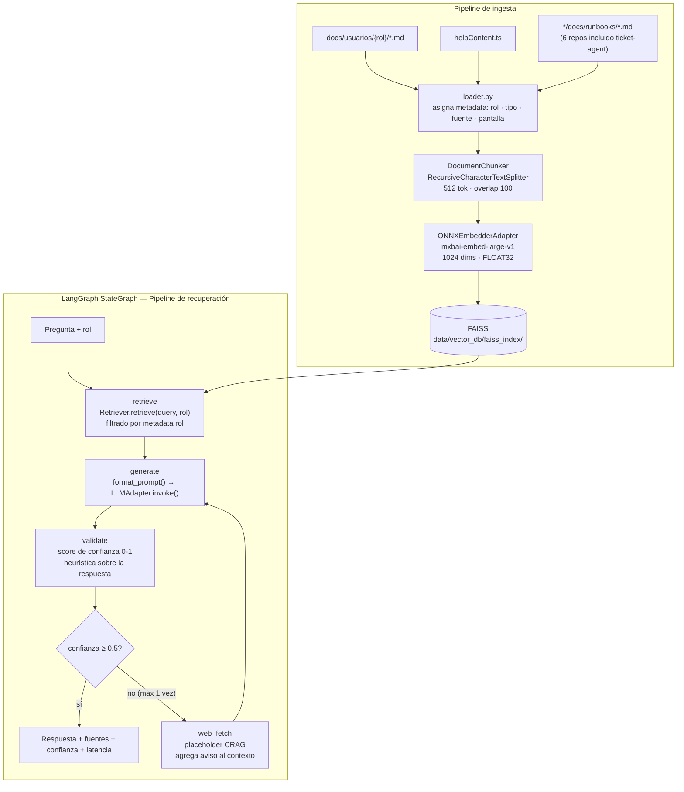
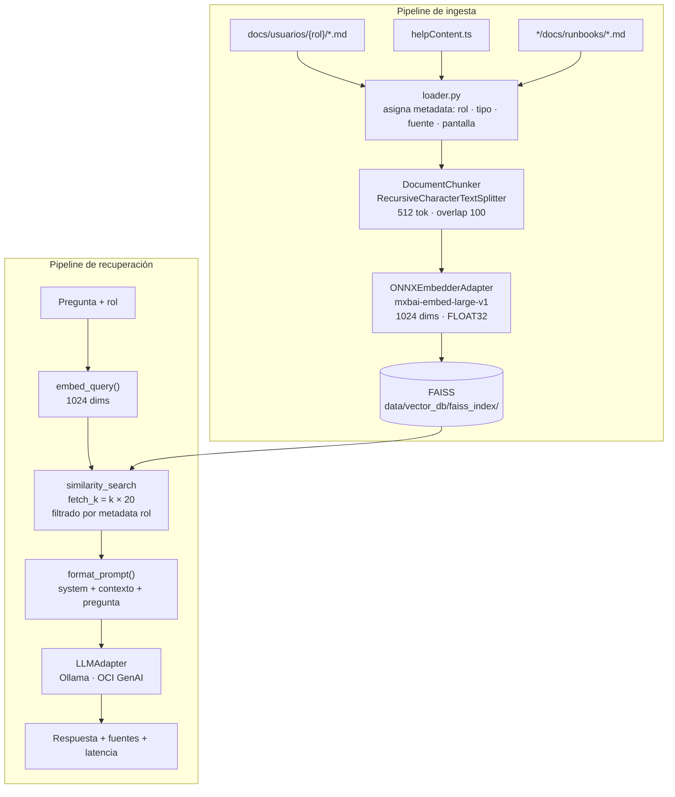
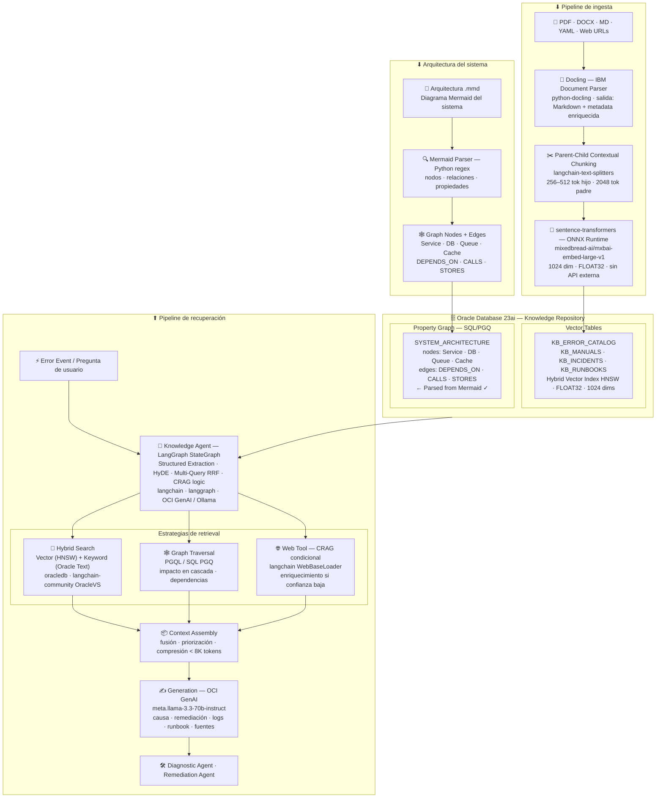

# 02 — Arquitectura Técnica

Descripción del diseño interno de ticket-agent, decisiones de arquitectura y ruta de evolución.

---

## Diagrama — Fase 3 (actual)



---

## Diagrama — Fase 1 (pipeline de ingesta)



---

## Diagrama — Visión completa (Fase 4)



---

## Visión general (Fase 3)

ticket-agent es un sistema RAG (Retrieval-Augmented Generation) orquestado por un
**LangGraph StateGraph**. Ante una pregunta, el grafo recupera documentación relevante,
genera una respuesta y valida su confianza — reintentando con contexto enriquecido
si la confianza es baja.

```
Pregunta + rol
     │
     ▼
[nodo: retrieve]
  ONNXEmbedderAdapter → embed_query(1024 dims)
  FAISSVectorStore.retrieve(query, k=3, rol=rol)
    ↳ similarity_search(fetch_k=60)
    ↳ filtrado por metadata["rol"] en Python
     │
     ▼
[nodo: generate]
  format_prompt(pregunta, contexto, rol)
  LLMAdapter.invoke(prompt)
    ↳ OllamaLLMAdapter  (PROVIDER=ollama)
    ↳ OCILLMAdapter     (PROVIDER=oci)
     │
     ▼
[nodo: validate]
  score confianza: 0.0 (sin docs) · 0.3 (respuesta baja) · 0.8 (ok)
     │
     ├─► confianza ≥ 0.5 ──────────────────► Respuesta + fuentes + confianza + latencia
     │
     └─► confianza < 0.5 (max 1 vez)
           │
           ▼
         [nodo: web_fetch]  ← placeholder CRAG (Fase 3 siguiente iteración)
           └─► generate → validate → END
```

---

## Decisión crítica: modelo de embeddings

| Parámetro | Valor |
|---|---|
| Modelo | `mixedbread-ai/mxbai-embed-large-v1` |
| Dimensiones | **1024** |
| Tipo | FLOAT32 |
| Razón | Compatible con Oracle 23ai Hybrid Vector Index desde Día 1 |

**Esta decisión es permanente** para la vida del índice actual. Cambiar el modelo
requiere re-ingestar todos los documentos. Fue elegido para que la migración FAISS → Oracle 23ai
sea un swap de adapter sin re-ingesta.

---

## Patrón de adapters

Toda dependencia externa (LLM, embeddings) se accede a través de una interfaz abstracta.
Esto permite cambiar de proveedor con solo modificar `.env`.

```
LLMAdapter (ABC)
  ├── OllamaLLMAdapter    → ChatOllama (langchain-ollama)
  └── OCILLMAdapter       → ChatOCIGenAI (langchain-oci)

EmbedderAdapter (ABC) + LangChain Embeddings
  └── ONNXEmbedderAdapter → SentenceTransformer (sentence-transformers)
```

Para agregar un proveedor nuevo: implementar la ABC y registrarlo en `main.py`.

---

## Fuentes de conocimiento y metadata

Un solo índice FAISS contiene chunks de las tres fuentes. El filtrado por rol se hace
post-retrieval en Python — no hay índices separados por rol.

Metadata por chunk:

| Campo | Valores posibles | Uso |
|---|---|---|
| `rol` | `["usuario"]`, `["manager", "admin"]`, `["soporte"]`, etc. | Filtrado por audiencia |
| `tipo` | `usuarios`, `runbooks`, `helpContent` | Tipo de fuente |
| `fuente` | path del archivo | Trazabilidad de la respuesta |
| `pantalla` | `newTicket`, `draftReview`, etc. | Solo para helpContent |

Mapeo pantalla → rol en `help_serializer.py`:

| Pantalla | Roles |
|---|---|
| newTicket, ticketDetail, attachments, ticketEvents | usuario, manager, admin |
| draftReview | manager, admin |
| classificationManagement, userManagement, permissionManagement | admin |

---

## Chunking

```
RecursiveCharacterTextSplitter
  chunk_size    = 512 tokens
  chunk_overlap = 100 tokens
  separators    = ["\n## ", "\n### ", "\n", " "]
```

En Fase 2 se migrará a Parent-Child chunking (hijo 256-512 / padre 2048) para mejorar
la calidad del contexto sin cambiar el modelo de embeddings.

---

## Estructura de carpetas clave

```
src/
├── main.py                    # CLI — entry point
├── config.py                  # Pydantic BaseSettings + .env
├── adapters/                  # Providers intercambiables (LLM + embeddings)
├── document_processing/       # Carga, parseo, chunking
├── vector_store/              # FAISS wrapper con filtrado por rol
├── rag/                       # Retriever + prompt templates
├── agent/                     # LangGraph StateGraph (Fase 3)
│   ├── state.py               # AgentState TypedDict
│   ├── nodes.py               # retrieve/multi_query, generate, validate, web_fetch
│   └── graph.py               # build_graph() → CompiledGraph
├── api/                       # REST API FastAPI (Fase 4)
│   ├── main.py                # FastAPI app + lifespan
│   ├── models/                # QueryRequest, QueryResponse, HealthResponse...
│   └── routes/                # /api/v1/health, /api/v1/info, /api/v1/query
└── utils/                     # Logger, validators

data/
├── vector_db/faiss_index/     # Índice FAISS persistido en disco
└── processed/chunks.jsonl     # Cache de chunks (diagnóstico)
```

---

## Ruta de evolución

```
FASE 1 ✅
  Vector store : FAISS-cpu local
  Embeddings   : mxbai-embed-large-v1, 1024 dims  ← FIJO
  Chunking     : flat (RecursiveCharacterTextSplitter)
  LLM          : Ollama local / OCI GenAI
  Interfaz     : CLI

         ↓ swap de adapter (sin re-ingesta por embeddings)

FASE 2 ⏳ (tablas Oracle pendientes)
  Vector store : Oracle 23ai Free (contenedor Podman)
  Embeddings   : mismo modelo ONNX
  Chunking     : Parent-Child (re-ingesta por estrategia)
  LLM          : OCI GenAI (recomendado)
  Factory      : VectorStoreFactory + LLMAdapterFactory

         ↓ orquestación avanzada

FASE 3 🔄 (en curso — sobre FAISS)
  Orquestación : LangGraph StateGraph ✅ (core implementado)
  Retrieval    : HyDE, Multi-Query RRF (pendiente)
  CRAG         : web_fetch condicional (placeholder activo)
  Graph        : Property Graph Oracle 23ai (requiere Fase 2)

         ↓ exposición como servicio

FASE 4
  Parser       : Docling (PDF, DOCX, YAML, Web)
  API          : FastAPI REST (puerto 8002)
  Container    : Dockerfile + podman-compose + ticket-management-network
  Observ.      : LangSmith ✅ (implementado en Fase 1)
```

---

## Dependencias principales

| Paquete | Versión | Rol |
|---|---|---|
| `langchain` | >=0.3,<2.0 | Orquestación base |
| `langchain-community` | >=0.3,<2.0 | FAISS integration |
| `langchain-ollama` | latest | Adapter Ollama |
| `langchain-oci` | 0.2.5 | Adapter OCI GenAI |
| `langgraph` | >=0.2,<2.0 | StateGraph — Fase 3 |
| `faiss-cpu` | 1.8.x | Vector store local |
| `sentence-transformers` | >=2.7 | Modelo ONNX embeddings |
| `pydantic-settings` | 2.x | Config desde .env |
| `click` | >=8.1 | CLI |
